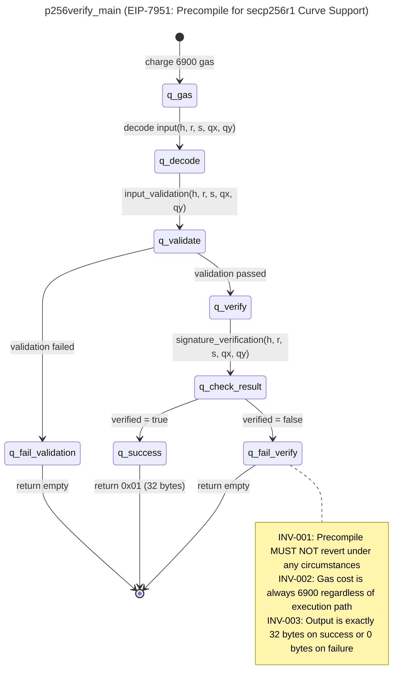

<h1 align="center">SPECA Codex</h1>

<p align="center">
  <a href="LICENSE"></a>
  
</p>

> **Unofficial fork:** This repository is an unofficial Codex App-compatible fork of SPECA. It is not affiliated with or endorsed by NyxFoundation or the upstream authors.

> **Upstream attribution:** This repository is based on [NyxFoundation/speca](https://github.com/NyxFoundation/speca), the SPECA implementation associated with Masato Kamba, Hirotake Murakami, and Akiyoshi Sannai, *Beyond Code Reasoning: A Specification-Anchored Audit Framework for Expert-Augmented Security Verification*, arXiv [2604.26495](https://arxiv.org/abs/2604.26495), 2026.

> **Japanese guide:** [README.ja.md](README.ja.md)

> **Codex edition:** This fork adapts SPECA so Codex can run the worker phases through Codex App, `codex app-server`, isolated worktrees, and the local FastAPI scheduler. It preserves the upstream MIT license and copyright notice, but does not claim that Codex-run audits reproduce the upstream Claude-run paper results. Upstream logos, generated paper figures, historical run outputs, and raw worker traces are intentionally not bundled in this fork.

## Authorized Use

SPECA is intended for defensive auditing and security research. Use it only on
repositories and systems you own, maintain, or are explicitly authorized to
assess through a contract, bug bounty, or other clear permission. Do not use
SPECA for unauthorized probing, exploitation, authentication bypass, or service
disruption. Treat `BUG_BOUNTY_SCOPE.json` and `TARGET_INFO.json` as the
authorized boundary for each run.

## What This Fork Is

This repository is a practical Codex App adaptation of SPECA. The upstream
project was designed around Claude Code workers; this fork keeps that workflow
available for compatibility while adding a Codex-oriented path:

- Codex App can start the local SPECA API, dispatch phases, watch progress, and
  collect results.
- SPECA can use `codex app-server` threads for long-running and parallel worker
  turns.
- Worker changes can be isolated in per-worker git worktrees and collected via
  the reducer/diff endpoint.
- When an API run omits `model`, SPECA can use the model and reasoning effort
  selected in the Codex App GUI.

For the original research claims, paper results, and full benchmark artifact
context, refer to the upstream SPECA repository and paper.

## Maintenance Scope

This is an unofficial Codex App-compatible fork. It is maintained as a Codex
App adaptation and may intentionally lag behind upstream. For the latest
upstream research implementation, use [NyxFoundation/speca](https://github.com/NyxFoundation/speca).

## Table of Contents

- [Why SPECA?](#why-speca)
- [Quick Start](#quick-start)
- [Demo](#demo)
- [Local Validation](#local-validation)
- [Architecture](#architecture)
- [Phases](#phases)
- [Running on GitHub Actions](#running-on-github-actions)
- [Configuration](#configuration)
- [Upstream Paper And Benchmarks](#upstream-paper-and-benchmarks)
- [Contributing](#contributing)
- [Citation](#citation)
- [License](#license)

## Why SPECA?

SPECA starts from specifications rather than only scanning repository-local code
patterns. It derives a typed property vocabulary from natural-language specs,
then asks an implementation to provide evidence that each property holds. This
fork keeps that pipeline shape and makes the worker runtime usable from Codex
App.

The upstream method is useful when an audit needs:

| | Code-driven auditing | SPECA (specification-anchored) |
|---|---|---|
| **Detection** | Finds defects that look like known bug patterns | Checks defects framed as violations of explicit, typed properties |
| **Cross-implementation comparison** | Each codebase analyzed in isolation | Single property vocabulary applied uniformly across N implementations |
| **False positive triage** | Opaque — "the model thought this was a bug" | Structured review metadata can tie disputed findings back to pipeline phases |

A second, often-overlooked benefit: because every finding is grounded in a
specific property derived from a specific spec section, each output can carry a
provenance chain (`property -> subgraph -> spec section -> INV-* label`). This
helps make findings auditable, not just generated.

### Why "proof-attempt" instead of "find bugs"

The upstream SPECA design uses a proof-attempt framing instead of simply asking
workers to "find bugs." The worker first maps a property to code evidence, then
tries to prove the property holds; reported findings are gaps in that proof
attempt. This fork does not change that core framing, but it lets Codex perform
the worker turns.

## Quick Start

### Prerequisites

- **Python 3.11+** and [`uv`](https://github.com/astral-sh/uv) (`pip install uv`)
- **Node.js 20+** (for worker CLIs and MCP servers)
- **Codex CLI** for Codex app-server and local fallback workers (`npm install -g @openai/codex`, or use the Codex desktop app bundle)
- **Claude Code CLI** only for legacy Claude-runner workflows
- **`git`** — used to prepare and verify the target checkout pinned in `outputs/TARGET_INFO.json`

### Install

```bash
# 1. Clone
git clone https://github.com/MekuraRabbit/speca-codex
cd speca-codex

# 2. Install Codex CLI (used by the Codex app-server runner)
npm install -g @openai/codex

# 3. Install Python deps via uv (creates an isolated env)
uv sync
```

The clone URL above points to this Codex App fork. If `uv sync` fails on
Windows while preparing legacy workflow extras, you can create a lightweight
environment for the Codex App API:

```bash
uv venv
uv pip install --python .venv/Scripts/python.exe pytest fastapi pydantic httpx aiofiles tqdm "uvicorn[standard]"
```

### Use It From Codex App

The primary path for this fork is **not** asking users to operate the CLI by
hand. Ask Codex in Codex App to run SPECA for you; Codex can start the
`speca-api` launch task, check health, dispatch phases, monitor progress, and
collect app-server thread metadata and diffs. The `curl` and CLI snippets below
are the underlying operations and are also useful for debugging.

For the first smoke test, ask Codex:

```text
Start the SPECA API for this repository and check /api/health.
Run a Codex App runner 01a smoke test, watch progress, and summarize
outputs/smoke_01a/01a_STATE.json when it finishes.
Use seed URL https://github.com/ethereum/EIPs/blob/master/EIPS/eip-7594.md
and output_dir outputs/smoke_01a.
```

For a production-like audit, prepare `outputs/BUG_BOUNTY_SCOPE.json` and
`outputs/TARGET_INFO.json`, then ask:

```text
Using the Codex App runner, run SPECA through target phase 04.
Enable isolated_worktrees. Use output_dir outputs/audit_<target-name>,
workers=4, and max_concurrent=8. Report progress, failed batches,
Codex app-server thread metadata, diff/reducer results, and final outputs.
```

For multiple targets:

```text
Dispatch two SPECA runs in parallel with distinct output_dir values.
Make sure no output_dir is reused. Track progress for both runs and compare
their final partials/results, failed batches, and diff metadata.
```

SPECA reads the Codex App GUI-selected model and reasoning effort from local
session metadata when the API dispatch omits `model`. Ask for
`service_tier: "fast"` only when you want to force the fast tier.

### Start the API Manually

From Codex App, launch `.codex/launch.json` entry `speca-api`. To start it
manually on Windows:

```bash
.venv/Scripts/python.exe -m uvicorn server.app:app --host 127.0.0.1 --port 8000
```

On macOS/Linux:

```bash
.venv/bin/python -m uvicorn server.app:app --host 127.0.0.1 --port 8000
```

Check the server:

```bash
curl http://127.0.0.1:8000/api/health
```

Expected response:

```json
{"status":"ok"}
```

### First Smoke Test

Start with `01a`; it does not require earlier SPECA outputs. This dispatch
uses Codex app-server workers by default when called through the API.

```bash
curl -X POST http://127.0.0.1:8000/api/phases/dispatch \
  -H "content-type: application/json" \
  -d '{"phase_id":"01a","workers":1,"max_concurrent":1,"spec_urls":"https://github.com/ethereum/EIPs/blob/master/EIPS/eip-7594.md","output_dir":"outputs/smoke_01a"}'
```

Use the returned `run_id` to stream progress:

```bash
curl -N http://127.0.0.1:8000/api/runs/<run_id>/progress
```

The output should appear at `outputs/smoke_01a/01a_STATE.json`.

### Full Audit Flow

SPECA phases consume outputs from earlier phases. Phases `03` and `04` require
the previous property and code-resolution artifacts to already exist.

| Order | Phase | Purpose | Main input |
|---|---|---|---|
| 1 | `01a` | Discover specification URLs | `spec_urls` |
| 2 | `01b` | Extract specification subgraphs | `01a_STATE.json` |
| 3 | `01e` | Generate security properties | `BUG_BOUNTY_SCOPE.json` |
| 4 | `02c` | Resolve properties to code locations | `TARGET_INFO.json` |
| 5 | `03` | Property-grounded audit | Outputs through `02c` |
| 6 | `04` | False-positive filtering and severity calibration | `03` output |

For a CLI run that executes dependencies up to `04`:

```bash
# Place these two files first:
#   outputs/BUG_BOUNTY_SCOPE.json   # required by Phase 01e
#   outputs/TARGET_INFO.json        # required by Phase 02c/03/04/05

uv run python scripts/run_phase.py --target 04 --runner codex-app --workers 4 --max-concurrent 8
```

Outputs are written to `outputs/<phase_id>_PARTIAL_*.json`. See the [Configuration](#configuration) section below for `BUG_BOUNTY_SCOPE.json` / `TARGET_INFO.json` formats.

### Run the test suite

```bash
uv run python -m pytest tests/ -v --tb=short
```

## Demo

This fork does not bundle the upstream generated demo artifacts, paper figures,
or historical audit outputs. Start with the Codex App smoke test in
[Use It From Codex App](#use-it-from-codex-app), then run your own authorized
target with a fresh `output_dir`.

Some inherited GitHub Actions workflows can still be useful as references for
legacy benchmark reproduction, but normal Codex App usage should start from the
local API and `codex app-server` runner.

## Local Validation

This fork has been exercised in local rehearsals against
[OpenZeppelin's Damn Vulnerable DeFi](https://github.com/OpenZeppelin/damn-vulnerable-defi),
an intentionally vulnerable educational benchmark, and the ERC-4626 portion of
[OpenZeppelin Contracts](https://github.com/OpenZeppelin/openzeppelin-contracts).
Treat these as compatibility and quality checks for the Codex App runner path,
not as production audit evidence or claims that SPECA discovered unknown
vulnerabilities in live protocols.

In the May 2026 local rehearsal:

- Phase 03/04 completed against the pinned local checkout and accounted for
  all 187 input properties.
- Phase 05 grouped the Phase 04 confirmed/potential findings into 9
  representative PoC candidates.
- All 9 representative PoC tests were manually implemented under the pinned
  target checkout and passed locally.
- The scoped run did not require external target fetches, RPC calls, registries,
  explorers, deployments, or account infrastructure.

A reproduction note is available at
[`docs/rehearsals/damn-vulnerable-defi-2026-05.md`](docs/rehearsals/damn-vulnerable-defi-2026-05.md).

A second May 2026 smoke rehearsal covered OpenZeppelin Contracts ERC-4626
`v5.6.1`:

- Phase 03/04 completed for 125 generated ERC-4626-focused properties.
- The original Phase 05 candidate index produced 6 PoC candidates.
- Post-run triage grouped those candidates into 2 root-cause families: a
  max-boundary standards-compliance edge case and a short-delivering underlying
  asset integration hazard family.
- The max-boundary family was reproduced with a local Hardhat PoC. The
  short-delivery family was treated as a conditional integration caveat, not as
  an independent OpenZeppelin core vulnerability claim.

A smoke rehearsal note is available at
[`docs/rehearsals/openzeppelin-erc4626-2026-05.md`](docs/rehearsals/openzeppelin-erc4626-2026-05.md).

Limitations:

- Damn Vulnerable DeFi is an educational target with intentionally planted
  vulnerabilities; this is not evidence of performance on arbitrary production
  repositories.
- The OpenZeppelin ERC-4626 rehearsal is a local smoke test and is not a
  vendor-ready audit report.
- Phase 03 finding counts are property-level signals, not counts of independent
  vulnerabilities.
- Phase 05 currently selects and structures PoC candidates. It does not yet
  fully automate exploit test implementation.

## Architecture

SPECA is organized as a **6-phase pipeline** in two stages: **Knowledge Structuring** (Phases 1–3) transforms natural-language specifications into explicit security properties, and **Systematic Auditing** (Phases 4–6) applies structured proof-attempt reasoning to check whether each implementation satisfies those properties.

In multi-implementation settings, the **left stage executes once** against the specification (producing a shared property vocabulary), and the **right stage executes per implementation** — enabling controlled cross-implementation security comparison by holding security expectations constant while varying the code under test.

| Stage | Phase | Name | Purpose |
|---|---|---|---|
| **Knowledge Structuring** | 1 | Specification Discovery | Crawl spec documents into a structured index |
|  | 2 | Subgraph Extraction | Decompose specs into [Nielson & Nielson](https://www.imm.dtu.dk/~hrni/) program graphs with RFC 2119–derived invariants |
|  | 3 | Property Generation | STRIDE + CWE Top 25 threat model → typed security properties (Invariant / Pre / Post / Assumption) |
| **Systematic Auditing** | 4 | Code Pre-resolution | Tree-sitter symbol resolution links each property to source locations (40–60% audit-token reduction) |
|  | 5 | Property-Grounded Audit | Per-property *Map → Prove → Stress-Test* — gaps in the proof are findings |
|  | 6 | Severity-Preserving Review | Three narrow mechanical gates (Dead Code / Trust Boundary / Scope) preserve H/M/L recall |

### The Audit Harness

The pipeline ships as a reusable **audit harness** under `scripts/orchestrator/` — not a one-off script. The harness provides the infrastructure that every phase needs (queueing, parallel worker dispatch, token-aware batching, resume on partial failure, optional per-phase budget guards for runners that report estimated costs, shared circuit-breaker logic, structured logs, and token-usage telemetry); each phase plugs in a worker prompt and a Pydantic schema and inherits all of the above for free. This separation is what makes the framework reusable: you can drop in a new phase, target a new codebase, or swap a model backbone without touching the harness itself.

Concretely, the harness:
- **Drives a worker runtime per batch**. Codex App server runs use `codex app-server` threads by default, with `codex exec` as a local fallback and the original Claude Code runner retained for legacy workflows.
- **Resumes from `outputs/*_PARTIAL_*.json`** so a 10-implementation RQ1 run that's interrupted at hour 4 picks up exactly where it left off without re-spending tokens.
- **Tracks token usage and optional budget guards** at the runner level. Normal Codex App summaries report token counts; raw runner/API payloads may still include estimated-cost fields for compatibility, but public summaries should not present them as actual API spend unless an API runner was explicitly used.
- **Validates leniently** — Pydantic schema mismatches generate warnings, not aborts; partial results are first-class and never blocked on validation failures.
- **Shares one circuit breaker per phase** across all workers, so systemic issues (bad prompt, API outage, schema drift) trigger a fast abort instead of N parallel failures.

In other words: the harness handles the messy parts of running a 100-target audit at scale, leaving the per-phase prompts to focus on auditing.

```
scripts/
├── run_phase.py            # Entry point
├── setup_mcp.sh            # MCP server registration
└── orchestrator/
    ├── config.py            # Phase definitions (PhaseConfig)
    ├── base.py              # BaseOrchestrator (async pipeline)
    ├── runner.py            # ClaudeRunner + CircuitBreaker
    ├── batch.py             # Token/count-based batching
    ├── queue.py             # Queue splitting & state
    ├── collector.py         # Result parsing & aggregation
    ├── resume.py            # Resume & cleanup manager
    ├── watchdog.py          # LogWatcher + CostTracker
    ├── schemas.py           # Pydantic data contracts
    └── factory.py           # create_orchestrator()
```

> **Phase ID note.** The paper uses Phase 1–6 labels; the codebase uses the legacy IDs `01a → 01b → 01e → 02c → 03 → 04` (a one-to-one mapping). Phases 5–6 of the paper correspond to legacy `03` (Audit Map) and `04` (Audit Review). The remainder of this README uses the legacy IDs to match the file layout.

## Phases

### Phase 01a: Specification Discovery

| | |
|---|---|
| **Prompt** | `prompts/01a_crawl.md` |
| **Skill** | `/spec-discovery` |
| **Input** | Seed URLs (via `SPEC_URLS` env var) |
| **Output** | `outputs/01a_STATE.json` |

Crawls seed URLs to discover all relevant technical specification documents. Uses the `mcp__fetch__fetch` tool to recursively follow links and build a catalog of specification pages.

<details>
<summary>Output example (<code>outputs/01a_STATE.json</code>, from <code>ethereum-fusaka-20260220</code>)</summary>

```json
{
  "start_url": "https://github.com/ethereum/EIPs/blob/master/EIPS/eip-7594.md",
  "found_specs": [
    {
      "url": "https://github.com/ethereum/EIPs/blob/master/EIPS/eip-7594.md",
      "title": "EIP-7594: PeerDAS - Peer Data Availability Sampling",
      "category": "EIP",
      "type": "Standards Track / Core",
      "status": "Final",
      "layer": "consensus+networking",
      "description": "Introducing simple DAS utilizing gossip distribution and peer requests..."
    },
    {
      "url": "https://github.com/ethereum/EIPs/blob/master/EIPS/eip-7823.md",
      "title": "EIP-7823: Set Upper Bounds for MODEXP",
      "category": "EIP",
      "type": "Standards Track / Core",
      "status": "Final",
      "layer": "execution",
      "description": "Restricts each MODEXP precompile input field to a maximum of 8192 bits..."
    }
  ],
  "metadata": {
    "timestamp": "2026-02-05T12:00:00Z",
    "keywords": ["ethereum", "fusaka", "fulu", "osaka", "..."],
    "total_specs": 28,
    "breakdown": { "eips": 11, "consensus_specs": 7, "execution_specs": 9 }
  }
}
```
</details>

### Phase 01b: Subgraph Extraction

| | |
|---|---|
| **Prompt** | `prompts/01b_extract_worker.md` |
| **Skill** | `/subgraph-extractor` |
| **Input** | `outputs/01a_STATE.json` |
| **Output** | `outputs/01b_PARTIAL_*.json` + `outputs/graphs/*/*.mmd` |

Extracts formal **Program Graphs** (following Nielson & Nielson's definition) from each specification document. Each subgraph is output as an enriched Mermaid state diagram (`.mmd`) with YAML frontmatter and inline invariant annotations. PARTIAL JSON files reference the `.mmd` paths for downstream consumption.

<details>
<summary>Output example — PARTIAL JSON (<code>outputs/01b_PARTIAL_W0B1_*.json</code>, from <code>ethereum-fusaka-20260220</code>)</summary>

```json
{
  "specs": [
    {
      "source_url": "https://github.com/ethereum/EIPs/blob/master/EIPS/eip-7951.md",
      "title": "EIP-7951: Precompile for secp256r1 Curve Support",
      "sub_graphs": [
        {
          "id": "SG-001",
          "name": "p256verify_main",
          "mermaid_file": "outputs/graphs/W0B1_1770278556/EIP-7951/SG-001_p256verify_main.mmd"
        },
        {
          "id": "SG-002",
          "name": "input_validation",
          "mermaid_file": "outputs/graphs/W0B1_1770278556/EIP-7951/SG-002_input_validation.mmd"
        },
        {
          "id": "SG-003",
          "name": "signature_verification",
          "mermaid_file": "outputs/graphs/W0B1_1770278556/EIP-7951/SG-003_signature_verification.mmd"
        }
      ]
    }
  ],
  "metadata": {
    "phase": "01b",
    "worker_id": 0,
    "batch_index": 1,
    "item_count": 2,
    "timestamp": 1770278944,
    "processed_ids": ["https://github.com/ethereum/EIPs/blob/master/EIPS/eip-7951.md"]
  }
}
```
</details>

<details>
<summary>Output example — enriched Mermaid file (<code>.mmd</code>)</summary>


</details>

### Phase 01e: Property Generation

| | |
|---|---|
| **Prompt** | `prompts/01e_prop_worker.md` (inlined — no skill fork) |
| **Input** | `outputs/01b_PARTIAL_*.json` + `outputs/BUG_BOUNTY_SCOPE.json` (required) |
| **Output** | `outputs/01e_PARTIAL_*.json` |

Performs inline trust model analysis and generates formal security properties from subgraphs. Combines former phases 01d (Trust Model) and property generation into a single inlined prompt. Key features:

- **Domain-agnostic STRIDE + CWE Top 25**: General STRIDE thinking framework augmented with CWE Top 25 patterns (CWE-22/78/89/94/200/502/639/770/862). No domain-specific hardcoding.
- **Reachability classification**: `external-reachable`, `internal-only`, `api-only`
- **Bug bounty scope determination**: Uses `severity_classification` from `BUG_BOUNTY_SCOPE.json` as authoritative severity definitions
- **Slim output**: `covers` is a string (primary element ID), `reachability` has 4 fields only (`classification`, `entry_points`, `attacker_controlled`, `bug_bounty_scope`)

The orchestrator **requires** `outputs/BUG_BOUNTY_SCOPE.json` and aborts if the file is missing.

<details>
<summary>Output example (<code>outputs/01e_PARTIAL_W0B1_*.json</code>, from <code>ethereum-fusaka-20260220</code>)</summary>

```json
{
  "properties": [
    {
      "property_id": "PROP-56ad1eb2-inv-001",
      "text": "P256VERIFY must accept valid secp256r1 signatures and reject all invalid ones deterministically.",
      "type": "invariant",
      "assertion": "forall (h,r,s,qx,qy): p256verify(h,r,s,qx,qy) == true iff ECDSA_verify(h,r,s,(qx,qy)) == true",
      "severity": "CRITICAL",
      "covers": "SG-003",
      "reachability": {
        "classification": "external-reachable",
        "entry_points": ["Transaction", "P2P"],
        "attacker_controlled": true,
        "bug_bounty_scope": "in-scope"
      },
      "bug_bounty_eligible": true,
      "exploitability": "external-attack"
    },
    {
      "property_id": "PROP-56ad1eb2-pre-001",
      "text": "Execution payload parent_hash must chain to state.latest_execution_payload_header.block_hash.",
      "type": "pre-condition",
      "assertion": "forall payload p: p.parent_hash == state.latest_execution_payload_header.block_hash",
      "severity": "HIGH",
      "covers": "SG-002",
      "reachability": {
        "classification": "external-reachable",
        "entry_points": ["P2P"],
        "attacker_controlled": true,
        "bug_bounty_scope": "in-scope"
      },
      "bug_bounty_eligible": true,
      "exploitability": "external-attack"
    }
  ],
  "metadata": {
    "timestamp": "1771748647",
    "total_properties": 45,
    "by_severity": { "CRITICAL": 9, "HIGH": 18, "MEDIUM": 16, "INFORMATIONAL": 2 },
    "by_scope": { "in_scope": 35, "out_of_scope": 10 },
    "bug_bounty_eligible_count": 30
  }
}
```
</details>

### Phase 02c: Code Location Pre-resolution

| | |
|---|---|
| **Prompt** | `prompts/02c_codelocation_worker.md` (inlined — no skill fork) |
| **Input** | `outputs/01e_PARTIAL_*.json` + `outputs/TARGET_INFO.json` + `outputs/01b_SUBGRAPH_INDEX.json` |
| **Output** | `outputs/02c_PARTIAL_*.json` |
| **Worker model** | Legacy Claude default: Sonnet. Codex App runs use the GUI-selected model/reasoning effort unless `model` is passed explicitly. |

Pre-resolves code locations for each property against the target repository using Tree-sitter MCP (primary) with Glob/Grep fallback. Records file paths, symbol names, and line ranges without extracting code. Applies severity gating (drops `Informational` properties by default). Builds `outputs/01b_SUBGRAPH_INDEX.json` from 01b partials for spec-level context. Reads `outputs/TARGET_INFO.json` (created by 02c workflow before phase runs).

Reduces token consumption in Phase 03 by ~40-60%.

<details>
<summary>Output example — resolved (<code>outputs/02c_PARTIAL_W0B1_*.json</code>)</summary>

```json
{
  "properties_with_code": [
    {
      "property_id": "PROP-56ad1eb2-inv-001",
      "text": "P256VERIFY must accept valid secp256r1 signatures and reject all invalid ones deterministically.",
      "type": "invariant",
      "assertion": "forall (h,r,s,qx,qy): p256verify(h,r,s,qx,qy) == true iff ECDSA_verify(h,r,s,(qx,qy)) == true",
      "severity": "CRITICAL",
      "covers": "SG-003",
      "reachability": { "classification": "external-reachable", "entry_points": ["Transaction", "P2P"], "attacker_controlled": true, "bug_bounty_scope": "in-scope" },
      "exploitability": "external-attack",
      "code_scope": {
        "locations": [
          {
            "file": "core/vm/contracts.go",
            "symbol": "p256Verify.Run",
            "line_range": { "start": 1433, "end": 1449 },
            "role": "primary"
          },
          {
            "file": "crypto/secp256r1/verifier.go",
            "symbol": "Verify",
            "line_range": { "start": 27, "end": 27 },
            "role": "callee"
          }
        ],
        "resolution_status": "resolved",
        "resolution_error": "",
        "resolution_method": "grep_fallback"
      }
    }
  ]
}
```
</details>

<details>
<summary>Output example — out-of-scope / not-found</summary>

```json
{
  "property_id": "PROP-56ad1eb2-inv-004",
  "text": "Blob commitment count in block must not exceed get_blob_parameters(epoch).max_blobs_per_block.",
  "code_scope": {
    "locations": [],
    "resolution_status": "out_of_scope",
    "resolution_error": "Property references get_blob_parameters (consensus-layer function). Target is ethereum/go-ethereum (execution client) with no consensus-layer logic."
  }
}
```
</details>

### Phase 03: Audit Map (Formal Audit)

| | |
|---|---|
| **Prompt** | `prompts/03_auditmap_worker_inline.md` (inlined — no skill fork) |
| **Input** | `outputs/02c_PARTIAL_*.json` + pinned local checkout from `TARGET_INFO.local_checkout` |
| **Output** | `outputs/03_PARTIAL_*.json` |
| **Worker model** | Legacy Claude default: Sonnet. Codex App runs use the GUI-selected model/reasoning effort unless `model` is passed explicitly. |

Performs a proof-based 3-sub-phase formal audit for each property against the target codebase. **The core method: try to prove the property holds; where the proof breaks, that gap is the bug.** This framing was chosen over an adversarial *"find bugs"* prompt after preliminary experiments showed the adversarial approach produced an **88% false positive rate** — without a structured claim to disprove, the model produced numerous speculative findings with weak grounding.

1. **Sub-phase 1 (Map):** Decompose the property's assertion into verifiable sub-claims, read the enforcement code completely (full function bodies plus callers/callees), and link each sub-claim to the code responsible for satisfying it.
2. **Sub-phase 2 (Prove):** Verify input coverage, path coverage, concurrency safety, temporal validity, and implementation-pattern obligations (e.g., cache keys and deduplication keys computed from complete inputs); gaps are recorded as findings.
3. **Sub-phase 3 (Stress-Test):** Challenge the conclusion — re-examine every assumption (if the proof succeeded) or attempt to construct a concrete attack path (if it failed); findings without a plausible attack path are downgraded to `potential-vulnerability`.

> "Proof attempt" is precise terminology: this is **LLM-driven evidence construction with structured reasoning steps, not formal verification**. The structure is what makes both detections and failures analyzable.

Compact 6-field output per item: `property_id`, `classification`, `code_path`, `proof_trace`, `attack_scenario`, `checklist_id`.

<details>
<summary>Output example — vulnerability found (Sherlock #190: Prysm inclusion proof cache poisoning)</summary>

```json
{
  "audit_items": [
    {
      "property_id": "PROP-6a4369e9-inv-042",
      "classification": "vulnerability",
      "code_path": "beacon-chain/verification/data_column.go::inclusionProofKey::L527-547",
      "proof_trace": "The cache key omits KzgCommitments (the data being proven), including only the inclusion proof and header hash. Two data columns with identical proofs/headers but different commitments produce the same cache key, causing the second to skip verification and reuse the first's cached result.",
      "attack_scenario": "Attacker sends valid DataColumnSidecar A, then sends forged DataColumnSidecar M with same inclusion proof and header but malicious KzgCommitments. Cache lookup succeeds on M's key, bypassing full Merkle verification and accepting invalid commitments.",
      "checklist_id": "PROP-6a4369e9-inv-042"
    }
  ],
  "metadata": {
    "phase": "03",
    "worker_id": 0,
    "batch_index": 81,
    "item_count": 1,
    "timestamp": 1771777036,
    "processed_ids": ["PROP-6a4369e9-inv-042"]
  }
}
```
</details>

<details>
<summary>Output example — not-a-vulnerability (proof succeeded)</summary>

```json
{
  "audit_items": [
    {
      "property_id": "PROP-6a4369e9-inv-047",
      "classification": "not-a-vulnerability",
      "code_path": "eip_7594/src/lib.rs::get_custody_groups::L52",
      "proof_trace": "The loop at L67 is guarded by validation at L52 (ensure! custody_group_count <= number_of_custody_groups). All call paths use local custody_group_count (validator-computed or config-derived), not peer-reported values.",
      "attack_scenario": "",
      "checklist_id": "PROP-6a4369e9-inv-047"
    }
  ]
}
```
</details>

### Phase 04: Audit Review

| | |
|---|---|
| **Prompt** | `prompts/04_review_worker.md` (inlined — no skill fork) |
| **Input** | `outputs/03_PARTIAL_*.json` + `outputs/BUG_BOUNTY_SCOPE.json` + `outputs/TARGET_INFO.json` |
| **Output** | `outputs/04_PARTIAL_*.json` |
| **Worker model** | Legacy Claude default: Sonnet. Codex App runs use the GUI-selected model/reasoning effort unless `model` is passed explicitly. |

Filters false positives from Phase 03 findings via a recall-safe 3-gate pipeline with early exit. **Only these 3 gates may produce DISPUTED_FP** — no other reasoning may dispute a finding:

1. **Gate 1 (Dead Code):** Grep for callers — zero non-test callers → DISPUTED_FP. Public/exported API exception: passes gate regardless of internal caller count. Skipped for "missing validation" findings.
2. **Gate 2 (Trust Boundary):** Look up the attack path's data source in `trust_assumptions` from BUG_BOUNTY_SCOPE.json — if trust level is TRUSTED/SEMI_TRUSTED and no untrusted path also reaches the code → DISPUTED_FP. No code analysis; purely a lookup.
3. **Gate 3 (Scope Check):** Check `out_of_scope`, `conditional_scope`, and `in_scope.scope_restriction` in BUG_BOUNTY_SCOPE.json — finding falls under an excluded category → DISPUTED_FP.

Items that pass all gates undergo severity calibration against `severity_classification` thresholds (with optional network-share-based severity cap from `deployment_context.client_diversity`). Non-findings (not-a-vulnerability, out-of-scope, informational) early-exit as PASS_THROUGH. Verdicts: CONFIRMED_VULNERABILITY, CONFIRMED_POTENTIAL, DISPUTED_FP, NEEDS_MANUAL_REVIEW, PASS_THROUGH. Severity caps are recorded separately as `severity_action: "DOWNGRADED"` so downgraded findings still flow into Phase 05.

<details>
<summary>Output example — CONFIRMED_VULNERABILITY</summary>

```json
{
  "reviewed_items": [
    {
      "property_id": "PROP-6a4369e9-pre-009",
      "review_verdict": "CONFIRMED_VULNERABILITY",
      "severity_action": "DOWNGRADED",
      "original_classification": "vulnerability",
      "adjusted_severity": "Medium",
      "reviewer_notes": "Spec requires: 'data_column_sidecars_by_root must reject requests exceeding MAX_REQUEST_DATA_COLUMN_SIDECARS'. Code reading verified: codec.rs:562-570 validates number of identifiers <=128, each identifier can have <=128 columns, enabling 128x128=16384 total columns. Handler rpc_methods.rs:408-460 lacks total column validation. Severity calibrated to Medium per BUG_BOUNTY_SCOPE.json: client market share <5%.",
      "spec_reference": "01e property PROP-6a4369e9-pre-009: 'data_column_sidecars_by_root must reject requests exceeding MAX_REQUEST_DATA_COLUMN_SIDECARS'"
    }
  ],
  "metadata": { "phase": "04", "worker_id": 1, "batch_index": 2, "item_count": 1, "timestamp": 1771818928, "processed_ids": ["PROP-6a4369e9-pre-009"] }
}
```
</details>

<details>
<summary>Output example — DISPUTED_FP (Gate triggered)</summary>

```json
{
  "reviewed_items": [
    {
      "property_id": "PROP-6a4369e9-inv-010",
      "review_verdict": "DISPUTED_FP",
      "severity_action": "NONE",
      "original_classification": "vulnerability",
      "adjusted_severity": "Informational",
      "reviewer_notes": "Phase 03 misunderstood the validation architecture. The array length validation DOES exist and IS enforced on all paths (gossip, RPC, and database loads). The claim of 'out-of-bounds panic' is false — the length check at kzg_utils.rs:84-89 prevents any indexing operation.",
      "spec_reference": "01e property: 'Column, kzg_commitments, and kzg_proofs arrays must all have equal length.' Code enforces this on all paths via kzg_utils.rs:84-89."
    }
  ]
}
```
</details>

<details>
<summary>Output example — DOWNGRADED (severity cap)</summary>

```json
{
  "reviewed_items": [
    {
      "property_id": "PROP-57888860-inv-006",
      "review_verdict": "CONFIRMED_POTENTIAL",
      "severity_action": "DOWNGRADED",
      "original_classification": "vulnerability",
      "adjusted_severity": "Low",
      "reviewer_notes": "Code reading verified: reconstruction.go:79 iterates Go map (sidecarByIndex) which has randomized iteration order, building cellsIndices without sorting before passing to RecoverCellsAndKZGProofs (line 86). Spec SG-024 explicitly requires 'assert cell_indices == sorted(cell_indices)'. Downgraded from Medium to Low: single-client bug affecting Prysm (31% CL share), below the 33% threshold for Medium severity.",
      "spec_reference": "Fulu Polynomial Commitments Sampling SG-024: INV requires cell indices unique and in ascending order"
    }
  ]
}
```
</details>

### Phase 05: PoC Candidate Selection And Generation

| | |
|---|---|
| **Candidate builder** | `scripts/build_phase05_candidates.py` |
| **Prompt** | `prompts/05_poc.md` |
| **Usage** | `uv run python scripts/run_phase.py --phase 05 --output-dir outputs/<run>` |
| **PoC prompt** | `/05_poc CANDIDATE_ID=... OUTPUT_DIR=outputs/<run>` |

Builds `05_POC_CANDIDATES.json` from Phase 04 confirmed/potential findings, groups duplicate root causes, and selects one representative PoC candidate per group. Conditional integration hazards, such as fee-on-transfer or otherwise short-delivering underlying-token cases, are grouped by prerequisite instead of being counted once per nearby symbol. The PoC prompt then generates a minimal, self-verifying test in the target project's native stack, records covered Phase 04 property IDs, and writes `05_POC_RESULT_<candidate_id>.json`.

```bash
uv run python scripts/run_phase.py --phase 05 --output-dir outputs/rehearsal_dvd
```

### Phase 06: Bug-Bounty Report (Manual)

| | |
|---|---|
| **Prompt** | `prompts/06_report.md` |
| **Usage** | `/06_report OUTPUT_DIR=outputs/<run> CANDIDATE_ID=... REPORT_TYPE=ETHEREUM` |

Generates a platform-tailored Markdown bug-bounty report (CANTINA, CODE4RENA, ETHEREUM, IMMUNEFI, SHERLOCK) from current SPECA run artifacts. It reads Phase 03/04 partials and optional Phase 05 candidate/result files from the selected `OUTPUT_DIR`, fills template placeholders with sanitized data, embeds verified PoC evidence when available, and avoids raw worker logs or local absolute paths.

### Phase 06b: Full Audit Report (Manual)

| | |
|---|---|
| **Prompt** | `prompts/06b_audit_report.md` |
| **Usage** | `/07_audit_report OUTPUT_DIR=outputs/<run> OUTPUT_PATH=outputs/<run>/AUDIT_REPORT.md` |

Compiles a publication-ready security assessment report covering the selected SPECA run. It summarizes scope, methodology, traceability, Phase 04 finding verdicts, Phase 05 PoC candidate coverage, limitations, and recommendations. Internal IDs are sanitized to sequential labels (for example, `Finding-01`) and generated claims must be grounded in the loaded run artifacts.

## Running on GitHub Actions

The upstream-style CI workflows are still available via **GitHub Actions**
with `workflow_dispatch` triggers. They are mainly useful for reproduction and
legacy runner automation. For normal Codex App use, start with the local API
flow in [Quick Start](#quick-start).

| Workflow | File | Description |
|---|---|---|
| 01a. Discovery | `01a-discovery.yml` | Crawl specification URLs |
| 01b. Subgraph Extraction | `01b-subgraph.yml` | Extract program graphs |
| 01e. Properties | `01e-properties.yml` | Trust model + property generation |
| 02c. Code Resolution | `02c-enrich-code.yml` | Pre-resolve code locations |
| 03. Audit Map | `03-audit-map.yml` | Proof-based 3-phase formal audit |
| 04. Audit Review | `04-audit-review.yml` | 3-gate FP filter + severity calibration |

Each workflow:
1. Checks out the repository and syncs the latest `scripts/`, `prompts/`, `.claude/` from the base branch.
2. Installs the worker CLI selected by the workflow and registers MCP servers via `scripts/setup_mcp.sh`.
3. Runs the orchestrator, for example: `uv run python scripts/run_phase.py --phase <ID> --runner codex-app --workers N`.
4. Commits results to an audit branch and uploads logs as artifacts.

For local execution, see [Quick Start](#quick-start) above.

### MCP Servers

The following MCP servers are registered by `scripts/setup_mcp.sh`:

| Server | Command | Used In |
|---|---|---|
| `tree_sitter` | `uvx mcp-server-tree-sitter` | 02c |
| `filesystem` | `npx -y @modelcontextprotocol/server-filesystem` | 01b, 02c |
| `fetch` | `uvx mcp-server-fetch` | 01a |

Note: Phases 01e, 03, and 04 use inlined prompts with no MCP servers (only built-in Read/Write/Grep/Glob tools).

## Configuration

SPECA expects two JSON files in `outputs/` before running the audit phases:

### `outputs/BUG_BOUNTY_SCOPE.json` — *required by Phase 01e and Phase 04*

Defines the trust model and severity rubric for the target. Phase 01e aborts (`sys.exit(1)`) if it is missing. Minimal shape:

```json
{
  "in_scope":   { "components": ["..."], "scope_restriction": "..." },
  "out_of_scope": ["..."],
  "conditional_scope": ["..."],
  "trust_assumptions": {
    "p2p_input":      { "trust_level": "UNTRUSTED",   "rationale": "..." },
    "consensus_state":{ "trust_level": "TRUSTED",     "rationale": "..." },
    "rpc_input":      { "trust_level": "SEMI_TRUSTED","rationale": "..." }
  },
  "severity_classification": {
    "CRITICAL": "Loss of funds / consensus split / mass DoS",
    "HIGH":     "...",
    "MEDIUM":   "...",
    "LOW":      "..."
  },
  "deployment_context": {
    "type": "multi-implementation",
    "target_share": { "value": 0.31, "metric": "validator-share" }
  }
}
```

`deployment_context.target_share.value` ∈ [0, 1] is used by Phase 04 as an optional severity cap (e.g. a single-client bug below a 33% network-share threshold gets downgraded).

### `outputs/TARGET_INFO.json` — *required by Phase 02c / 03 / 04 / 05*

Pins the target repository, commit, and local checkout used by worker phases.
Prepare the checkout locally at `local_checkout`; SPECA workers treat that path
as the exact target code root.

```json
{
  "target_repo": "ethereum/go-ethereum",
  "target_ref_type": "branch",
  "target_ref_label": "master",
  "target_commit": "abc1234deadbeef...",
  "target_commit_short": "abc1234deadb",
  "local_checkout": "target_workspace/go-ethereum",
  "language": "go"
}
```

Use the canonical field names shown above for files and JSON Schema
validation. Python helpers still normalize older local `repo` / `commit`
aliases before validation, but new runs and external tools should not rely on
those aliases.

### Environment Variables

| Variable | Used By | Purpose |
|---|---|---|
| `ANTHROPIC_API_KEY` | Legacy Claude runner | Claude Code authentication |
| `SPECA_CODEX_MODEL` | Codex runners | Optional explicit Codex model override; API runs normally read the Codex App GUI model when `model` is omitted |
| `SPECA_CODEX_REASONING_EFFORT` | Codex app-server runner | Optional explicit reasoning effort override (`low`, `medium`, `high`, `xhigh`, etc.) |
| `SPECA_CODEX_SERVICE_TIER` | Codex app-server runner | Optional service tier override (`fast` or `flex`) |
| `SPECA_API_HOST` | Local FastAPI server | Optional manual bind host override; defaults to `127.0.0.1` |
| `SPECA_API_PORT` | Local FastAPI server | Optional manual port override; defaults to `8000` |
| `SPECA_API_RELOAD` | Local FastAPI server | Set to `1`/`true` to enable uvicorn reload for local development |
| `SPECA_ENABLE_API_RUNNER_DISPATCH` | Local FastAPI server | Opt-in gate for dispatching the OpenAI-compatible API runner through the local API |
| `SPECA_API_RUNNER_BASE_URL_ALLOWLIST` | Local FastAPI server | Comma-separated API runner base URLs allowed when API runner dispatch is enabled |
| `SPECA_API_RUNNER_KEY_ENV_ALLOWLIST` | Local FastAPI server | Comma-separated environment variable names allowed for API runner keys when API runner dispatch is enabled |
| `SPEC_URLS` | 01a | Comma-separated seed URLs to crawl |
| `KEYWORDS` | 01a | Optional crawl keyword filter |
| `FORCE_EXECUTE=1` | All phases | Bypass resume state (set automatically by `--force`) |
| `CLAUDE_CODE_PERMISSIONS=bypassPermissions` | CI | Skip interactive permission prompts |
| `CLAUDE_CODE_MAX_OUTPUT_TOKENS=100000` | CI | Raise output cap for long audit traces |
| `GITHUB_PERSONAL_ACCESS_TOKEN` | Optional | Used by GitHub MCP server when enabled |

## Upstream Paper And Benchmarks

This fork is based on upstream SPECA, but it is packaged as a Codex App
adaptation rather than as a reproduction bundle for the upstream paper. The
original paper results were produced by the upstream project and its runner
setup. Because this fork changes the worker runtime to support Codex App and
`codex app-server`, this repository does not claim that Codex-run audits
reproduce those exact results.

Upstream logos, rendered paper figures, historical run outputs, and raw worker
logs are intentionally omitted from this fork. Benchmark code and dataset
descriptions are kept only where they help users run their own authorized
evaluations.

For the original research claims, benchmark discussion, and paper artifact
bundle, see:

- [NyxFoundation/speca](https://github.com/NyxFoundation/speca)
- [arXiv:2604.26495](https://arxiv.org/abs/2604.26495)
- [benchmarks/README.md](benchmarks/README.md) for the retained benchmark
  harness notes in this fork

Raw worker logs and model trace logs are intentionally omitted from this Codex
fork. Generated run logs are ignored by default.

## Contributing

We welcome issues and pull requests from the community.

- **Bugs / feature requests:** open a GitHub issue in this repository with a minimal reproducer or a concrete use-case.
- **Pull requests:**
  1. Fork the repo and create a topic branch off the default branch.
  2. Run the test suite: `uv run python -m pytest tests/ -v --tb=short`.
  3. Keep changes focused — pipeline phases are deliberately decoupled, so a PR should usually touch one phase at a time.
  4. Open the PR with a brief description of *what* changed and *why*. If the change affects an inter-phase data contract, update `scripts/orchestrator/schemas.py` and the relevant prompt under `prompts/` together.
- **New target domains:** SPECA is domain-agnostic by design. To onboard a new target, you typically only need to write a `BUG_BOUNTY_SCOPE.json` and a `TARGET_INFO.json` — no code change required.

## Citation

If you use SPECA in academic work, please cite the accompanying paper:

```bibtex
@misc{kamba2026speca,
  title         = {Beyond Code Reasoning: A Specification-Anchored Audit Framework for Expert-Augmented Security Verification},
  author        = {Kamba, Masato and Murakami, Hirotake and Sannai, Akiyoshi},
  year          = {2026},
  eprint        = {2604.26495},
  archivePrefix = {arXiv},
  primaryClass  = {cs.CR},
  url           = {https://arxiv.org/abs/2604.26495}
}
```

## License

SPECA is released under the [MIT License](LICENSE). See the `LICENSE` file for full terms.

> **Disclaimer.** SPECA is a research artifact. Findings produced by the pipeline are *candidate* vulnerabilities and **must** be validated by a human auditor before being reported to a vendor or bug-bounty program. The maintainers make no warranty as to the completeness or correctness of any audit produced by this software.
